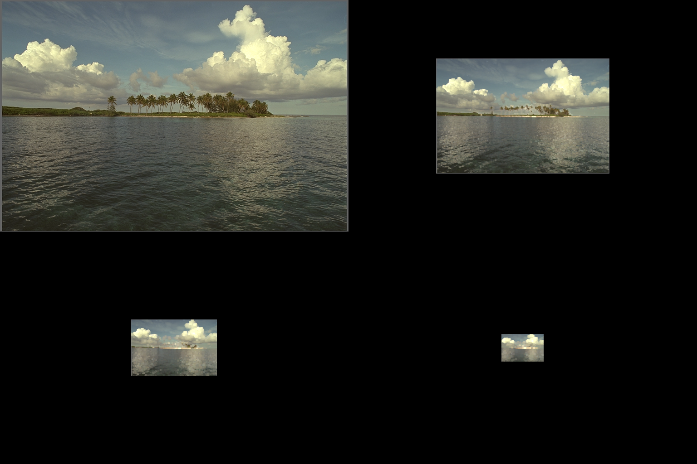

Tensors and Arrays for Imaging
==================================

Views
--------------

We refer to an image's **view** as the order of the dimensions for its
channels-width-height, e.g. **chw or hwc**, along with the ordering of the
channel dimension, e.g. **RGB or BGR**.

The following commonly used packages have their own default **view** for images:

============= ========================= =============
 Package       Data Type                   View
============= ========================= =============
 PyTorch       Torch Tensors/Variables    chw-RGB
------------- ------------------------- -------------
 OpenCV [#]_   Numpy Arrays               hwc-BGR
------------- ------------------------- -------------
 PyPlot        Numpy Arrays               hwc-RGB
============= ========================= =============

.. [#] OpenCV provides its own functionality for changing the channel ordering.

``Type and View Conversions``
~~~~~~~~~~~~~~~~~~~~~~~~~~~~~~~~~~~

:func:`dlt.util.change_view` can be used to convert between views. Please see the
documentation for available views.

.. code-block:: python3
   :emphasize-lines: 4

    # Load image using OpenCV
    img = cv2.imread('kodim16.png')
    # Change the view and display with pyplot
    plt_img = change_view(img, 'cv', 'plt')
    plt.imshow(plt_img)
    plt.show()

.. image:: assets/kodim16.png
   :scale: 50 %
   :align: center

Functions such as :func:`dlt.util.cv2torch`, :func:`dlt.util.torch2cv` and
:func:`dlt.util.torch2plt`, change the view as well as the data type.
They also accept Variables or GPU Tensors as inputs and always return a Tensor
or Array (copy) in main memory.

.. code-block:: python3
   :emphasize-lines: 6

    # Load image using OpenCV
    img = cv2.imread('kodim16.png').astype('float32')/255.0
    # Model to processes the image
    net = nn.MaxPool2d(5,stride=2).cuda()
    # Create input using cv2torch and get result
    result = net(Variable(util.cv2torch(img).unsqueeze(0).cuda()))
    
Displaying
----------------------

.. _example-displaying-imshow:

``imshow``
~~~~~~~~~~~~~~~

:func:`dlt.viz.imshow` can be used to display images. Accepts Arrays and Tensors as 
well as different views. The view must be provided as an argument.

.. code-block:: python3
   :emphasize-lines: 4
    
    # Load image using OpenCV
    img = cv2.imread('kodim16.png')
    # Display image for 5 seconds
    dlt.viz.imshow(img, view='cv')
    

``make_grid``
~~~~~~~~~~~~~

:func:`dlt.util.make_grid` can be used to create grids. It can accept mixed lists of
Arrays, Tensors and Variables, as well as different sized images (as long as
they have the same view).

.. code-block:: python3
   :emphasize-lines: 8

    # Load image using OpenCV
    img = cv2.imread('kodim16.png').astype('float32')/255.0
    # Model to processes the image
    net = nn.MaxPool2d(5,stride=2).cuda()
    result = net(Variable(util.cv2torch(img).unsqueeze(0).cuda()))
    # Make a grid with the images
    input_img = dlt.util.change_view(img, 'cv', 'torch') # all must have the same view
    viz.imshow(dlt.util.make_grid([input_img, result, net(result), net(net(result))]))

HDR
----------------

The functions :func:`dlt.hdr.imread` and :func:`dlt.hdr.imwrite` support all
the OpenCV formats (including '.hdr' and '.exr') as well as '.pfm'.