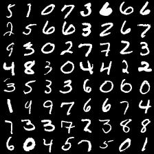
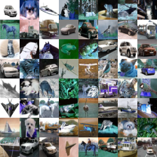

.. _config-example:

Workflow Quickstart
=========================

.. code-block:: python3

    import dlt

Logging
------------------------

:class:`dlt.util.Logger` can be used to create CSV logs.

.. code-block:: python3

    log = dlt.util.Logger('losses', ['training', 'validation'])
    log({'training': 10, 'validation':20})

Checkpointing
------------------------

:class:`dlt.util.Checkpointer` can be used to create checkpoints for any
(torch serializable) objects.

.. code-block:: python3

    data_chkp = Checkpointer('data')
    a = np.array([1,2,3])
    data_chkp.save(a)
    a = None
    a = data_chkp.load()

Checkpointers automatically save and load a network's state dict.

.. code-block:: python3

    net_chkp = Checkpointer('model')
    net = nn.Linear(10, 10)
    data_chkp.save(net)
    net = None
    # net needs to be passed to the checkpointer to set the state dict.
    data_chkp.load(net)

Built-in Trainers
------------------------

The trainers (:ref:`train-doc`) provide an easy to use interface for quick experimentation.

.. code-block:: python3

    # Define a trainer
    if use_gan:
        trainer = dlt.train.VanillaGANTrainer(generator, discriminator, g_optim, d_optim)
        log = dlt.util.Logger('gan_training', trainer.loss_names_training())
    else:
        trainer = dlt.train.VanillaTrainer(generator, nn.MSE(), g_optim)
        log = dlt.util.Logger('normal_training', trainer.loss_names_training())
    
    # Training is just iterating the trainer with a data loader.
    # See the trainers documentation for more detail
    for batch, (prediction, losses) in trainer(loader):
        log(losses)

Configuration
------------------------

The package provides a parser, with some built-in command line arguments. These
can be used to quickly configure experiments without much boilerplate code.
Extra arguments can be added. 

.. code-block:: python3

    # file main.py
    # Add some extra command line options to the built-in ones
    dlt.config.add_extras([{'flag': '--extra_opt', 'default': 'foo'}])
    # Parse
    opt = dlt.config.parse(verbose=False)
    # Can access built in options as well as the added ones
    print('Some Settings: ', opt.experiment_name, opt.batch_size, opt.lr, opt.extra_opt)

Using configuration files makes bookkeeping a lot easier.

.. code-block:: cfg

    # file settings.cfg
    # Can use commented lines
    --experiment_name config_test
    --lr 1e-4
    --batch_size 64
    # Can also set any extra settings
    --extra_opt bar

Invoke the `main.py` script from above using these settings:

.. code-block:: bash

    $ python main.py @settings.cfg
    Some Settings:  config_test 64 0.0001 bar

The functions in :ref:`config-doc` use the built-in arguments and can be
configured from the command line.

Arguments belong to categories. Each category can be split into subsets.

.. code-block:: python3
    :emphasize-lines: 5,6,8,9

    # file main.py
    # Split dataset settings
    dlt.config.make_subsets({'dataset': ['set1', 'set2']})
    # Training set
    set1_data = dlt.config.torchvision_dataset(preprocess=cv2torch, subset='set1')
    set1_loader = dlt.config.loader(set1_data)
    # Validation set
    set2_data = dlt.config.torchvision_dataset(preprocess=cv2torch, subset='set2')
    set2_loader = dlt.config.loader(set2_data)

    for (img, lbl) in set1_loader:
        dlt.viz.imshow(dlt.util.make_grid(img, color=False), pause=2.0)
        break

    for (img, lbl) in set2_loader:
        dlt.viz.imshow(dlt.util.make_grid(img, color=True), pause=2.0)
        break

.. code-block:: cfg

    # file settings.cfg
    --batch_size 64
    # We can set the split arguments like so:
    # set1
    --named_dataset_set1 mnist
    --data_set1 ~/data/mnist
    # set2
    --named_dataset_set2 cifar10
    --data_set2 ~/data/cifar10

.. code-block:: bash

    $ python main.py @settings.cfg

The following is a configuration file template with the default values:

.. literalinclude:: assets/template.cfg

Command Line Plotting
------------------------

:ref:`plot-doc` can be used from the command line to plot CSV files. 

- Live update using the '-r'/'--refresh' flag (seconds). 

    .. code-block:: bash

        dlt-plot -f training.csv -r 5

- Select columns using their number or name after the file.

    .. code-block:: bash

        dlt-plot -f averages.csv train_loss val_loss

- Plot multiple files/columns. This will plot columns 0 and 3 from file_1.csv
  and column 4 from file_2.csv

    .. code-block:: bash

        dlt-plot -f file_1.csv 0 3 -f file_2.csv 4 

- Select the first/last points to plot using '--head'/'--tail' (or remove using
  '--rhead'/'--rtail).

    .. code-block:: bash

        dlt-plot -f data.csv --head 100

- Average/Variance every <N> points using '--sub_avg'/'--sub_var'.

    .. code-block:: bash

        dlt-plot -f training.csv --sub_avg 10

- Moving Average/Variance every <N> points using '--mov_avg'/'--mov_var'.

    .. code-block:: bash

        dlt-plot -f training.csv --mov_avg 10

- If multiple columns, files are used then the settings can be set for each
  individual column. This will sub_avg training by 1000 and validation by 100:

    .. code-block:: bash

        dlt-plot -f training.csv -f validation.csv --sub_avg 1000 100

- NOTE: Transformations are applied in the order they are encountered. E.g. this
  will plot points 5-10:

    .. code-block:: bash

        dlt-plot -f training.csv --head 10 --tail 5

  whereas this will plot points end-10 to end-5:

    .. code-block:: bash

        dlt-plot -f training.csv --tail 10 --head 5
 
There are more available flags (logarithmic axes, setting titles, labels etc).
For more information:

.. code-block:: bash

    dlt-plot --help

Dispatching
------------------------

:ref:`dispatch-doc` can be used from the command line to create a self contained
experiment in a directory. Useful for saving snapshots of code that is likely
to change.

.. code-block:: bash
    
    dlt-dispatch experiment_name -d ~/experiments -m main.py -e settings.cfg

The above code will create a directory ~/experiments/experiment_name containg main.py
and settings.cfg.

